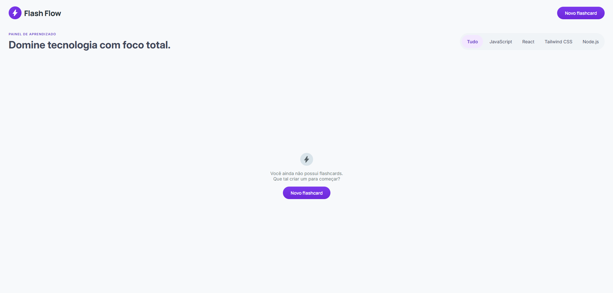

# 📚 Flash Flow

Uma aplicação web para criação e gerenciamento de flashcards, desenvolvida como desafio final da pós-graduação Dev Start da Rocketseat.

O objetivo do projeto é ajudar no aprendizado contínuo através da técnica de *active recall*, permitindo que usuários criem, organizem e revisem conteúdos de forma simples e eficiente.



---

## ✨ Funcionalidades

* ➕ Criação de flashcards
* ✏️ Edição de cards existentes
* 🗑️ Exclusão com confirmação
* 🔄 Flip de cards (pergunta ↔ resposta)
* 🏷️ Organização por categorias
* 🔍 Filtro por categoria
* 💅 Interface moderna e responsiva

---

## 🧠 Conceitos aplicados

* Componentização com React
* Gerenciamento de estado
* Reutilização de componentes
* Boas práticas de UX/UI
* Comunicação com API (CRUD)
* Separação de responsabilidades (frontend/backend)

---

## 🗂️ Estrutura do projeto

```bash
flash-flow/
│
├── web/
│   ├── src/
│   │   ├── components/
│   │   │   ├── Button/
│   │   │   ├── Filter/
│   │   │   ├── Flashcard/
│   │   │   ├── FlashcardForm/
│   │   │   ├── FlashcardModal/
│   │   │   ├── Modal/
│   │   │   └── NewFlashcardButton/
│   │   │
│   │   ├── services/
│   │   │   └── api.ts
│   │   │
│   │   ├── assets/
│   │   ├── styles/
│   │   └── App.tsx
│   │
│   └── package.json
│
├── server/
│   ├── src/
│   ├── .env.example
│   └── package.json
│
└── README.md
```

---

## 🚀 Como rodar o projeto

### 🔽 1. Clone o repositório

```bash
git clone https://github.com/AlineGuiseline/flashflow2.0.git
cd flashflow2.0
```

---

### 📦 2. Instale as dependências

#### Frontend

```bash
cd web
npm install
```

#### Backend

```bash
cd ../server
npm install
```

---

### ⚙️ 3. Configure as variáveis de ambiente

Crie um arquivo `.env` dentro da pasta `server` baseado no `.env.example`:

```bash
cp .env.example .env
```

---

### ▶️ 4. Rode o projeto

#### Backend

```bash
npm run dev
```

#### Frontend

```bash
cd ../web
npm run dev
```

---

## 🌐 Acesso

* Frontend: http://localhost:5173
* Backend: http://localhost:3000/flashcards

---

## 📌 Próximos passos (melhorias)

* 🔐 Autenticação de usuários
* ☁️ Persistência em banco de dados real
* 📊 Sistema de revisão inteligente (spaced repetition)
* 🎨 Animações e microinterações
* 📱 Versão mobile aprimorada

---

## 💜 Sobre o projeto

Este projeto foi desenvolvido como parte da conclusão da pós-graduação Dev Start da Rocketseat, com foco em aplicar na prática conceitos modernos de desenvolvimento frontend, UX e arquitetura de aplicações.

---

## 👩‍💻 Autora

Desenvolvido por [Aline Guiseline](https://www.linkedin.com/in/alineguiseline/) 💫
